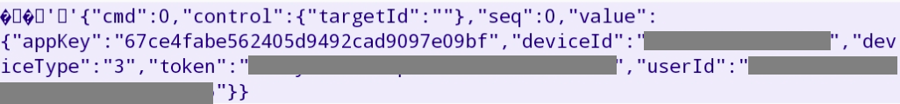

# Home assistant proscenic 790T vacuum integration

the purpose of this integration is to provide an integration of proscenic 790T vacuum. 
It allow home assistant to:
- start cleaning
- pause cleaning
- go to dock
- retrieve vacuum informations (battery, state)


## Installation

### HACS installation

TODO

### Manual installation

1. Go to [releases page](https://github.com/deblockt/hass-proscenic-790T-vacuum/releases)
2. download the last release zip
3. unzip it on `custom_components` directory
4. see next chapter for configuration

## Configuration

To add your vacuum on home assistant, you should add this: 

``` yaml
vacuum:
  - platform: proscenic
    host: "<vacuum-ip>"
    deviceId: ""
    token: ""
    userId: ""
    name: ""
```

deviceId, token and userId can be retrieved using the Proscenic robotic application :
1. On your smartphone, install [Packet capture](https://play.google.com/store/apps/details?id=app.greyshirts.sslcapture&hl=fr)
2. Open Packet capture and start a capture  select Proscenic  Robotic app
3. Open the proscenic application, and open the vacuum view
4. Reopen  Packet capture 
    1. click on the first line
    2. click on the line `47.91.67.181:20008`
    3. get you informations 
5. you can add you vacuum on lovelace ui entities

## Know issue

- At home assistant startup the vacuum cleaner if not retrieved. You should perform an action on home assistant to get le vacuum cleaner status. 
- If you start the proscenic application, the status of the vacuum cleaner will not be refreshed on home assistant for 60 seconds.
