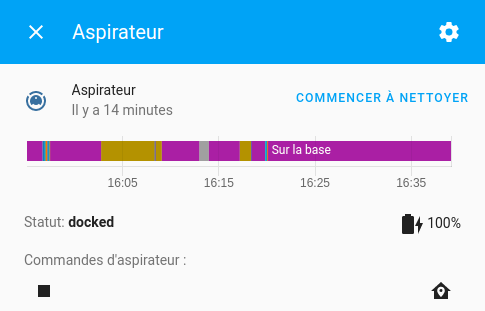
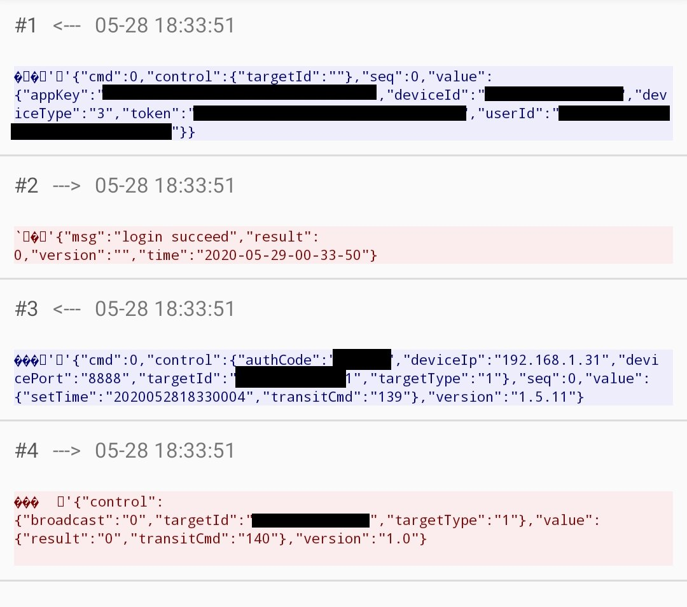
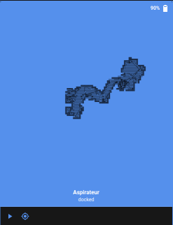

# Home assistant proscenic 790T vacuum integration

[](https://www.buymeacoffee.com/deblockt)

The purpose of this integration is to provide an integration of proscenic 790T vacuum. 
It allow home assistant to:
- start cleaning
- pause cleaning
- go to dock
- retrieve vacuum informations (battery, state)
- show the cleaning map



## Installation

### HACS installation

TODO

### Manual installation

1. Go to [releases page](https://github.com/deblockt/hass-proscenic-790T-vacuum/releases)
2. download the last release zip
3. unzip it on `custom_components` directory
4. see next chapter for configuration

## Configuration

To add your vacuum on home assistant, you should add this: 

``` yaml
vacuum:
  - platform: proscenic
    host: "<vacuum-ip>"
    deviceId: ""
    token: ""
    authCode: ""
    userId: ""
    name: ""
    sleep_duration_on_exit: # default 60. number of second waiting before reconnection (if you use proscenic app)
```

deviceId, token and userId can be retrieved using the Proscenic robotic application :
1. On your smartphone, install [Packet capture](https://play.google.com/store/apps/details?id=app.greyshirts.sslcapture&hl=fr)
2. Open Packet capture and start a capture  select Proscenic  Robotic app
3. Open the proscenic application, and open the vacuum view
4. Reopen  Packet capture 
    1. click on the first line
    2. click on the line `<your_vacuum_ip>:8888`
    3. get you informations 
5. you can add your vacuum on lovelace ui entities
    1. You can simply add it as an entity
    2. You can use the [vacuum-card](https://github.com/denysdovhan/vacuum-card)

## Cleaning map management



### Configuration

The vacuum cleaning map can be displayed on lovelace-ui (it will be displayed only after the first vacuum clean process).

to work you should add a camera entity.

``` yaml
camera:
  - platform: local_file 
    name: vacuum_map
    file_path: "/tmp/proscenic_vacuum_map.svg"
```

You can use this camera on lovelace to show the map.

The default path to generate the map is `/tmp/proscenic_vacuum_map.svg`. You can define another using this configuration :

``` yaml
vacuum:
  - platform: proscenic
    map_path: "your_custome_map_path"
```

### Add to lovelace

 To display the camera on lovelace, you can :
- use the [vacuum-card](https://github.com/denysdovhan/vacuum-card) configure the card using code editor and add map property `map: camera.vacuum_map`.
``` yaml
entity: vacuum.my_vacuum
image: default
map: camera.vacuum_map
type: 'custom:vacuum-card'
```

- or use a card of type `picture-entity` 
``` yaml
type: picture-entity
entity: vacuum.my_vacuum
camera_image: camera.vacuum_map
aspect_ratio: 100%
show_state: true
show_name: true
tap_action:
  action: more-info
```


## Available attributes

Theses attributes are available to be displayed on lovelace-ui:
- `clear_area`: number of m2 cleaned
- `clear_duration`: last clean duration in second
- `error_code`: the current error code, if vacuum is on error status
- `error_detail`: the current error message (in english), if vacuum is on error status

## Know issue

- At home assistant startup the vacuum cleaner status is not retrieved. You should perform an action on home assistant to get the vacuum cleaner status. 
- If you start the proscenic application, the status of the vacuum cleaner will not be refreshed on home assistant for 60 seconds.
- If you start the proscenic application, you will be disconnected 60 seconds later. You can configure this time using `sleep_duration_on_exit` configuration.
